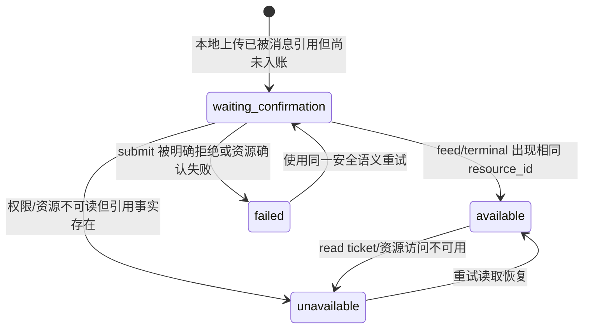
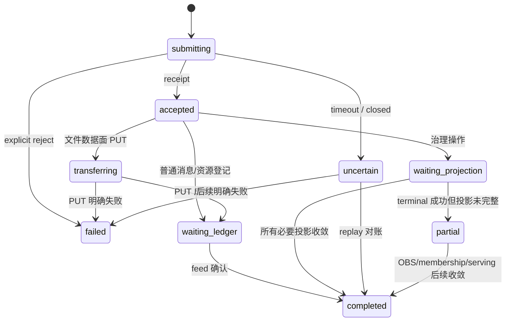
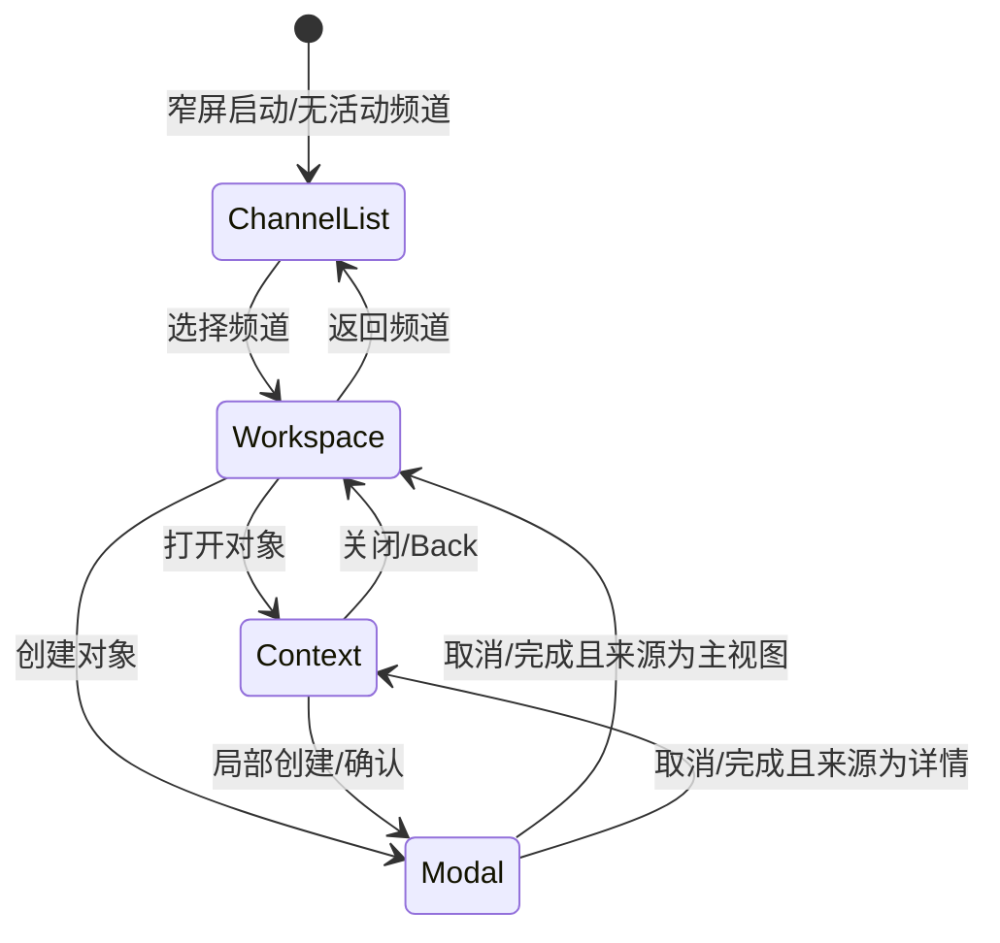

# 前端 D1：对象与导航详细规格

状态：设计完成，尚未施工
日期：2026-08-18
上位计划：[FRONTEND-PRODUCT-IMPROVEMENT-MASTER-PLAN.md](FRONTEND-PRODUCT-IMPROVEMENT-MASTER-PLAN.md)
后端与实现约束：[BUILD-SPEC.md](BUILD-SPEC.md)

## 0. 规格定位

本文完成前端体验改进的 D1 设计阶段，定义：

- `SourceRef`、`Artifact`、`WorkItem`、`Operation` 的字段、身份和派生规则；
- Dynamic、Artifacts、Tasks 三个主视图；
- Thread/回合、产物、任务、Actor、频道详情五类 Context Pane；
- URL、浏览器历史、返回来源、刷新恢复和本地状态边界；
- 宽屏、中屏、窄屏的表面状态机；
- 空态、权限、错误、未知结果和对象失效矩阵；
- D1 到 D2/F1–F4 的交付契约。

本文不包含：

- React、CSS 或 Mock 修改；
- 视觉 token 和高保真稿；
- 新后端消息类型的实现承诺；
- 通过文件名猜版本、通过文本猜任务等不可靠推断；
- 现有协议和 feed fold 的重写。

## 1. 事实分层

前端对象必须注明自己来自哪一层事实。

| 层级 | 权威性 | 示例 | 可否跨端恢复 |
|---|---|---|---|
| Ledger | 最高 | request、provisional、activity、terminal、附件元数据 | 可以 |
| OBS | 当前投影 | 频道、membership、roster、serving、daemon | 可以，但可能 partial/stale |
| Receipt | 操作受理证据 | submit、after、resource ticket | 单独不能证明最终业务事实 |
| Local durable | 设备局部事实 | pending submission、timer id、草稿、视图偏好 | 仅本设备 |
| Local ephemeral | 临时 UI | 打开的 Popover、Hover、预览缩放 | 不恢复 |

所有产品对象必须携带 `provenance`，UI 根据 provenance 决定文案和可信程度。

```ts
type Provenance =
  | 'ledger'
  | 'obs'
  | 'receipt'
  | 'local_durable'
  | 'local_ephemeral'
  | 'derived';
```

`derived` 必须能追溯到一组权威输入，不能表示“前端猜的”。

## 2. 通用身份和不变量

### 2.1 标识规范

产品对象使用前端稳定 key，不覆盖协议原始 id。

```text
channel       channel:{channel_id}
turn          turn:{channel_id}:{request_id}
entry         entry:{channel_id}:{envelope_id}
artifact      artifact:{channel_id}:{resource_id}
work item     work:{channel_id}:{kind}:{native_id}
participant   participant:{channel_id}:{actor_id}
operation     operation:{operation_id}
```

若 envelope 缺失 id：

- 仍可按 `seq` 显示；
- 不生成可分享对象 URL；
- 标记账本 anomaly；
- 不使用 `seq` 冒充永久业务 id。

### 2.2 频道隔离

任何对象 key、索引、缓存和导航都必须包含 `channel_id`。切换 active channel 不改变对象归属。

### 2.3 单向派生

```text
feed / OBS / local safe records
  → fold
  → domain indexes
  → selectors
  → product surfaces
```

页面不得反向修改 fold 或把渲染结果写回领域索引。

### 2.4 重放等价

对相同 feed 行集合：

- 从空状态全量 fold；
- 从缓存恢复后 replay；
- 历史和实时分批接收；

必须生成相同的 Artifact 和 Ledger-derived WorkItem 索引。时间、随机数和当前视图不得影响结果。

## 3. SourceRef

### 3.1 目的

`SourceRef` 是跨主视图、Context Pane、Activity 和 Operation Center 的统一导航指针。它只保存定位信息，不复制来源对象内容。

### 3.2 字段

```ts
type WorkspaceView = 'dynamic' | 'artifacts' | 'tasks';

type SourceObjectType =
  | 'channel'
  | 'entry'
  | 'turn'
  | 'artifact'
  | 'work_item'
  | 'participant'
  | 'operation';

interface SourceRef {
  channelId: string;
  view: WorkspaceView;
  objectType: SourceObjectType;
  objectId: string;
  seq?: number;
  requestId?: string;
  envelopeId?: string;
}
```

### 3.3 不变量

- `objectId` 使用第 2.1 节稳定 key；
- `seq` 只用于滚动提示和附近定位，不作为唯一身份；
- `requestId/envelopeId` 是协议诊断与索引捷径；
- SourceRef 不保存对象标题、文件名、消息文本或用户姓名；
- 目标不存在时显示“来源暂不可用”，不得跳到相似对象；
- 频道无访问权限时保留引用信息，但不泄露已清除的对象内容。

### 3.4 生成规则

| 来源对象 | 默认 view | objectType |
|---|---|---|
| 普通消息/事件 | dynamic | entry |
| RequestTurn | dynamic | turn |
| 文件/结构化产物 | artifacts | artifact |
| 审批/运行中/任务/自动动作 | tasks | work_item |
| Actor | dynamic | participant |
| 频道设置 | dynamic | channel |
| 后台操作 | 保留发起时 view | operation |

### 3.5 返回来源

Context Pane 只保存一个 `openedFrom: SourceRef`，不建立无限详情栈。

- 从动态打开文件：关闭预览回到动态原消息；
- 从产物列表打开文件：关闭预览回到产物列表原滚动位置；
- 从 Thread 再打开文件：预览取代 Thread，关闭后回到 Thread；
- 直接 URL 打开详情：没有 `openedFrom`，关闭后回到该对象所属默认主视图；
- 连续进入第三层详情时，使用页面内链接返回上一个 Context，不同时叠加两块 Pane。

会话内允许一个最多 4 项的轻量 `contextTrail`，只用于 Back，不写入持久缓存。频道切换或显式主 Tab 切换时清空。

## 4. Artifact

### 4.1 定义

Artifact 是频道内已形成、可再次使用、可追溯来源的产物。它不等于任意 resource，也不等于任意 JSON。

```ts
type ArtifactKind =
  | 'file'
  | 'document'
  | 'image'
  | 'audio'
  | 'video'
  | 'table'
  | 'list'
  | 'report'
  | 'structured';

type ArtifactState =
  | 'waiting_confirmation'
  | 'available'
  | 'unavailable'
  | 'failed';

interface Artifact {
  key: string;
  channelId: string;
  resourceId?: string;
  kind: ArtifactKind;
  name: string;
  mediaType?: string;
  size?: number;
  state: ArtifactState;
  authorActorId?: string;
  createdAt?: string;
  firstSeq: number;
  lastSeq: number;
  source: SourceRef;
  versionOf?: string;
  derivedFrom: string[];
  references: SourceRef[];
  preview: 'inline' | 'text' | 'image' | 'media' | 'download_only' | 'unsupported';
  provenance: Provenance;
  diagnostic?: {
    address?: string;
    errorCode?: string;
    detail?: string;
  };
}
```

### 4.2 准入规则

以下对象进入 Artifact 索引：

1. request payload 中合法的 `attachments[]`；
2. terminal payload 中由已登记 adapter 识别的 `attachments[]`、单一 attachment 或正式产物字段；
3. 已知业务类型的结构化终态，且其 TypeMeta/adapter 明确声明 `artifact_kind`；
4. resource list/OBS 将来若提供正式频道资产投影，可作为补充权威来源；
5. 本地上传只有在随消息入账或出现正式 resource terminal 后才成为频道 Artifact。

以下对象不得自动进入：

- 任意含 `value` 的 registrar 结果；
- actor.describe；
- 任意 JSON object/array；
- ticket receipt；
- 只出现在消息自然语言中的文件名；
- 本地选择但尚未发送的文件；
- PUT 成功但没有账本/正式资源确认的孤立文件。

### 4.3 Attachment adapter

合法 attachment 至少有：

```ts
interface AttachmentFact {
  resource_id: string;
  name?: string;
  media_type?: string;
  size?: number;
  address?: string;
}
```

规则：

- key 为 `artifact:{channelId}:{resource_id}`；
- 首次出现建立 source 和 createdAt；
- 后续出现追加 references，更新 lastSeq；
- 后续元数据只填补缺失字段，不覆盖相互冲突的已知事实；
- 冲突进入 artifact anomaly，诊断详情可见；
- address 只进入 diagnostic，不在普通列表显示；
- 同 resource id 在不同频道是不同 Artifact。

### 4.4 结构化产物 adapter

结构化结果只有满足以下之一才进入：

- TypeMeta 明确提供 `ui.artifact_kind` 与稳定业务 id 字段；
- 前端闭集 adapter 对正式类型定义 `idSelector/nameSelector/kind`；
- payload 明确包含后端约定的 `artifact` 对象。

临时第一版不得通过字段数量、标题或数组形状猜测。

### 4.5 状态



`available` 表示有正式引用事实且当前可请求读取，不表示浏览器永远持有有效 ticket。

### 4.6 版本和派生关系

只接受明确关系：

- payload 的 `version_of` / `derived_from` 正式字段；
- 已登记 adapter 的等价字段；
- 用户在“基于此产物修订”动作中产生的新请求，其 parent/source 明确指向原 Artifact；
- Agent 终态回传相同关系。

禁止根据 `v2`、`final`、文件名相似或时间邻近猜测。

若关系只有本地请求上下文、尚未入账：先显示“修订处理中”；终态未确认前不写永久 versionOf。

### 4.7 预览策略

| 类型 | 默认预览 | 降级 |
|---|---|---|
| 图片 | 站内图片预览 | 下载 |
| 纯文本/Markdown/JSON | 安全文本预览 | 下载 |
| 音视频 | 原生媒体控件 | 下载 |
| PDF | 浏览器/PDF 预览 | 下载 |
| DOCX/PPTX/XLSX | 元数据与下载；后续有安全渲染再开放 | 下载 |
| 未知类型 | 无预览 | 下载 |

预览每次需要读取内容时重新获取 read ticket；不得持久化 ticket。

## 5. WorkItem

### 5.1 定义

WorkItem 是需要用户关注、决定或继续推进的工作对象聚合，不等于单一后端 Task 表。

```ts
type WorkItemKind =
  | 'task'
  | 'approval'
  | 'agent_run'
  | 'recovery'
  | 'automation';

type WorkItemState =
  | 'active'
  | 'waiting'
  | 'blocked'
  | 'uncertain'
  | 'completed'
  | 'failed'
  | 'cancelled'
  | 'expired';

interface WorkItem {
  key: string;
  channelId: string;
  kind: WorkItemKind;
  nativeId: string;
  title: string;
  state: WorkItemState;
  assigneeActorIds: string[];
  requesterActorId?: string;
  dueAt?: string;
  waitingFor?: string;
  priority?: 'normal' | 'high' | 'urgent';
  source: SourceRef;
  relatedArtifacts: string[];
  createdAt?: string;
  updatedAt?: string;
  actionableBySelf: boolean;
  provenance: Provenance;
  localScope?: 'this_device';
  diagnostic?: Record<string, unknown>;
}
```

### 5.2 类型来源

#### approval

- 来源：未终结的 `human.approve` RequestTurn；
- nativeId：approval request id；
- assignee：audience；
- state：未过期为 waiting，过期为 expired，terminal 映射 completed/failed；
- actionableBySelf：当前 self actor 在 audience、频道可写、未过期、无 terminal。

#### agent_run

- 来源：尚无 terminal 的普通 RequestTurn；
- nativeId：request id；
- assignee：audience；
- processing/queued 为 active，deferred/unavailable 为 waiting/blocked；
- terminal 后默认退出 Active，但在 Completed 过滤中可查。

#### recovery

来源闭集：

- pending submission `uncertain`；
- 可安全重试的明确失败；
- 上传等待确认/失败；
- 治理操作 partial convergence；
- OBS 与 terminal 长时间不一致且有明确恢复动作。

不得把所有 failed terminal 自动变成 recovery；没有安全动作的失败只在动态和 Activity 中展示。

#### automation

- 来源：当前设备保存的 timer record；
- nativeId：timer id；
- 必须显示 `localScope='this_device'` 和“本设备记录”；
- scheduled → waiting，fired → completed，cancelled → cancelled；
- 不得与跨端完整任务混淆。

#### task

普通工作任务只有满足以下条件之一才存在：

1. 后端正式任务类型和结果契约；
2. 某 Actor `describe` 明确支持约定的 task capability，并返回可重放的稳定任务 id/状态；
3. 将来正式任务 OBS。

没有支持者时：

- 不显示“从消息创建任务”动作；
- Tasks 仍可展示 approval、agent_run、recovery、automation；
- 空态说明“当前频道没有可创建任务的成员”，而不是在 localStorage 伪造任务。

### 5.3 task capability 最小契约

D1 只定义前端所需能力，不宣告后端已支持：

```text
task.create
  input: title, description?, assignee?, due_at?, source?
  terminal: task_id, status

task.update
  input: task_id, status?, assignee?, due_at?
  terminal: task_id, status

task.list 或正式 OBS
  output: stable task rows
```

正式字段在后端契约确定前不得写入生产代码。Mock 只能在 capability 声明存在的场景开放入口。

### 5.4 状态归一化

| 原事实 | WorkItem state |
|---|---|
| queued / processing | active |
| received | active |
| deferred | waiting |
| receiver unavailable | blocked |
| pending uncertain | uncertain |
| completed | completed |
| failed + cancelled | cancelled |
| failed | failed |
| approval past expires_at | expired |
| scheduled timer | waiting |

原始状态继续保存在 diagnostic；UI 不用归一化状态反向生成协议动作。

### 5.5 去重和排序

- 同 native id、kind、channel 只产生一个 WorkItem；
- Active 默认排序：urgent/high → actionableBySelf → updatedAt 降序；
- Completed 默认按 updatedAt 降序；
- For me：assignee 包含 self actor，或 approval 当前可由 self 处理；
- All：当前用户有权读取的频道对象；
- 本设备 automation 永远带本地范围标志。

## 6. Operation

### 6.1 定义

Operation 表示一次仍在提交或跨投影收敛的写操作。它不是最终业务对象，也不是 Toast。

```ts
type OperationKind =
  | 'message_submit'
  | 'file_upload'
  | 'channel_create'
  | 'participant_change'
  | 'actor_lifecycle'
  | 'channel_retire'
  | 'resource_mutation'
  | 'automation_change';

type OperationState =
  | 'submitting'
  | 'accepted'
  | 'transferring'
  | 'waiting_ledger'
  | 'waiting_projection'
  | 'uncertain'
  | 'completed'
  | 'partial'
  | 'failed'
  | 'cancelled';

interface Operation {
  key: string;
  operationId: string;
  channelId: string;
  kind: OperationKind;
  title: string;
  state: OperationState;
  source: SourceRef;
  requestId?: string;
  resourceId?: string;
  startedAt: number;
  updatedAt: number;
  checkpoints: Array<{
    id: string;
    label: string;
    state: 'pending' | 'completed' | 'failed' | 'unknown';
  }>;
  recoveries: Array<'retry' | 'reopen' | 'refresh' | 'copy_diagnostics'>;
  error?: { code: string; detail?: string };
  provenance: Provenance;
}
```

### 6.2 生命周期



### 6.3 持久化

可持久化：operation id、kind、channel、source、request/resource id、状态、checkpoint、时间和脱敏错误。

禁止持久化：

- ticket；
- 文件字节或 Blob URL；
- 密钥和 credential；
- 未脱敏 payload；
- DOM/File 对象。

文件页面刷新后若失去本地 File 对象：Operation 显示“需要重新选择本地文件”，不能假装继续 PUT。

### 6.4 Operation 与 WorkItem

- Operation 回答“这次写操作收敛了吗”；
- WorkItem 回答“还有什么工作需要关注”；
- uncertain/partial Operation 可以派生 recovery WorkItem；
- Operation completed 后从活动中心折叠，但其最终业务对象留在账本/产物/任务中；
- 两者使用同一 SourceRef，不能复制不同来源。

## 7. 三个主视图

### 7.1 共同契约

每个主视图必须：

- 占据 Workspace 的主内容区；
- 拥有自己的 Header action、空态、过滤和滚动状态；
- 切换时不改变频道；
- 不自动打开 Context Pane；
- URL 可表达 active channel 和 view；
- 恢复上次滚动/过滤；
- 在 access 变化时一致转为只读；
- 不显示其他主视图专属输入器。

### 7.2 Dynamic

#### 目的

回答“这个频道发生了什么、谁正在做什么、结果是什么”。

#### 宽屏线框

```text
┌ Channel Header ─────────────────────────────────────────┐
│ # channel                  Search   Members   •••        │
├ Dynamic ─ Artifacts ─ Tasks ────────────────────────────┤
│                                                        │
│  Date / unread divider                                 │
│                                                        │
│  Avatar  Name  AI  time  PROACTIVE                     │
│          message / request                             │
│          [artifact] [structured result]                 │
│          working status / final                         │
│          thread · task · more (hover/focus)             │
│                                                        │
│  compact system event                                  │
│                                                        │
├ Composer ───────────────────────────────────────────────┤
│ target / @ · multiline draft                           │
│ attach · format                          send · options  │
└────────────────────────────────────────────────────────┘
```

#### 条目层级

1. 人类/Agent 业务条目；
2. WorkTurn 进展和终态；
3. 对象附件与结构化产物；
4. 审批；
5. 系统事件；
6. anomaly/诊断。

主线只展示 1–4。系统事件按语义压缩；anomaly 默认进入诊断入口。

#### WorkTurn 展示

- open：请求、当前阶段、最近人类可读 provisional、必要控制；
- terminal：最终结果直接可见，过程摘要一行；
- 进入回合详情后显示全部 provisional/activity/anomaly/raw ids；
- terminal 冲突继续使用第一终态作为权威，同时在详情显示异常。

#### Composer

只在 Dynamic 出现。切到 Artifacts/Tasks 时草稿仍按频道保留，不占据页面底部。

### 7.3 Artifacts

#### 目的

回答“这个频道形成了什么产物，它从哪里来、当前是否可用”。

#### 线框

```text
┌ Channel Header ─────────────────────────────────────────┐
├ Dynamic ─ Artifacts ─ Tasks ────────────────────────────┤
│ Artifacts                         Upload                │
│ [Search…] [All types⌄] [Anyone⌄] [Recent⌄]             │
│                                                        │
│ Recently updated                                       │
│ ┌ preview ┐  Budget proposal v2.docx                   │
│ │         │  Doc Editor · from “Revise fallback…”      │
│ └─────────┘  DOCX · 37.2 KB · available        •••     │
│                                                        │
│ ┌ preview ┐  Comparison table                          │
│ │         │  Researcher · structured · updated 2m      │
│ └─────────┘  table · 18 rows                    •••     │
└────────────────────────────────────────────────────────┘
```

#### 过滤

- query：名称、可见作者名、已索引的安全摘要；
- kind：file/document/image/media/table/list/report/structured；
- author：当前业务 roster；
- time：recent/newest/oldest；
- state：默认隐藏 failed，可单独查看。

过滤属于本地视图状态，不改变对象事实。

#### 上传入口

点击 Upload 打开文件选择，选中后：

- 默认回到 Dynamic，并把文件加入该频道 Composer 草稿；
- 用户可以补充消息和目标后发送；
- 高级“仅上传为频道资源”只有后端提供正式资源登记事实后开放；
- 不在 Artifacts 首屏展示 daemon、path 和 ticket。

#### 点击行为

点击整行打开 Artifact Context。更多菜单提供下载、附加到草稿、回到来源、复制诊断 id（高级）等可用动作。

### 7.4 Tasks

#### 目的

回答“现在有哪些工作需要我或频道成员继续处理”。

#### 线框

```text
┌ Channel Header ─────────────────────────────────────────┐
├ Dynamic ─ Artifacts ─ Tasks ────────────────────────────┤
│ Tasks                                      New task     │
│ [For me] [All]  [Active⌄] [All types⌄]                 │
│                                                        │
│ NEEDS YOU                                              │
│ Approval · Deploy production                           │
│ requested by Agent A · expires in 20m        Review    │
│                                                        │
│ ACTIVE                                                 │
│ Agent run · Research competitors                       │
│ Researcher · processing · from message          Open   │
│                                                        │
│ AUTOMATION · THIS DEVICE                               │
│ Send weekly summary · tomorrow 09:00          Cancel   │
└────────────────────────────────────────────────────────┘
```

#### Tabs 与过滤

- For me / All；
- Active（active/waiting/blocked/uncertain）/ Completed / Failed；
- All types / Tasks / Approvals / Agent runs / Recovery / Automation。

#### New task

只有存在 task capability 时启用。多个支持者时先选择负责的 Agent；只有一个合理支持者时默认选中但可修改。

#### 空态

- 无对象、有 task provider：“还没有任务；可以新建，或从消息创建”；
- 无对象、无 task provider：“当前频道没有正式任务能力；审批、运行中回合和自动动作出现后会汇总到这里”；
- 过滤后为空：“没有符合当前筛选的项目”；
- 无权限：保留可读列表，隐藏/禁用写动作并解释。

## 8. Context Pane

### 8.1 共同外壳

```text
ContextPane
├─ Header
│  ├─ type / title
│  ├─ source/back action
│  └─ close
├─ Scroll body
└─ optional sticky action footer
```

不允许内部再创建独立全屏抽屉。Pane 中的 Select/Popover 必须 portal 或受可视边界约束，且不改变父布局尺寸。

### 8.2 Thread / 回合详情

两种模式共享外壳，但语义不同：

- Thread：围绕来源条目的业务回复；只有后端/消息关系支持时开放回复；
- 回合详情：展示现有 RequestTurn 的完整过程和控制，可立即施工。

内容顺序：

1. 根请求/消息；
2. 当前状态与终态；
3. provisional 时间线；
4. tool activity；
5. approval 和控制记录；
6. 关联产物；
7. anomaly 和脱敏 JSON（诊断折叠）。

“View in channel”使用根对象 SourceRef 返回并定位。

Thread 回复只有正式 parent/reply 契约时出现；现有 `parent_id` 用于请求/响应和控制相关性，不能直接当作社交 Thread 语义。

### 8.3 Artifact Context

内容：

- 预览；
- 名称、类型、大小、状态；
- 作者和创建时间；
- 来源消息/回合；
- versionOf / derivedFrom / references；
- 下载、附加到草稿、基于此修订；
- 读取失败的重试和诊断。

`基于此修订` 只有目标 Actor 支持相关能力或可以建立明确 source payload 时出现。

### 8.4 WorkItem Context

按 kind 显示：

- task：描述、负责人、状态、截止、来源、关联产物和更新动作；
- approval：影响、Schema 表单、到期和最终处理者；
- agent_run：当前阶段、控制、过程和终态；
- recovery：未知/部分状态、已经确认的事实和安全恢复动作；
- automation：本设备标识、触发时间、payload 摘要和取消。

### 8.5 Participant Context

内容：业务身份、kind、角色、serving、能力、当前关联 WorkItem、调用能力和治理动作。标准 Actor 默认不显示。高风险动作使用 Inline Confirmation。

### 8.6 Channel Context

信息顺序固定：

1. 成员和添加入口；
2. 频道介绍、父级和状态；
3. 通知偏好（后端/本地支持时）；
4. 成员权限和邀请；
5. 技术信息折叠；
6. 危险操作。

新建频道不是 Channel Context 的一个 Tab；输入使用 Modal，提交后 Operation Center 跟踪收敛，成功后进入新频道。

## 9. URL 与导航模型

### 9.1 第一阶段路由形式

当前项目没有路由依赖，也没有部署端 SPA fallback 契约。F1 第一阶段使用 hash route，避免刷新深链得到 404：

```text
/#/channels/{channelId}/{view}
/#/channels/{channelId}/{view}?focus={objectType}:{encodedObjectKey}
```

示例：

```text
/#/channels/c1/dynamic
/#/channels/c1/artifacts?focus=artifact:artifact%3Ac1%3Ares-123
/#/channels/c1/tasks?focus=work_item:work%3Ac1%3Aapproval%3Areq-9
```

`channelId` 和 focus value 必须 encode/decode，禁止字符串拼接后直接选择 DOM。

将来部署层提供 history fallback 后可以迁移 path route；对象模型不随路由形式变化。

### 9.2 URL 存什么

URL 保存：

- channelId；
- active workspace view；
- 可分享且稳定的 focus 对象。

URL 不保存：

- scrollTop；
- Hover/Popover；
- 文件 ticket；
- 表单草稿；
- Context trail；
- transient filter menu 状态；
- 敏感字段。

### 9.3 History 规则

| 动作 | History |
|---|---|
| 切频道 | push |
| 切主视图 | push |
| 打开稳定详情 | push |
| 关闭详情 | back（若当前会话打开）或 replace 到主视图 |
| 改过滤/排序 | replace 或仅本地，不制造大量历史 |
| Hover/Popover/Modal 输入 | 不写 URL |
| 创建成功进入新频道 | push |

浏览器 Back 必须按“详情 → 主视图 → 上一个主视图/频道”的用户路径工作。

### 9.4 URL 校验

- 未登录：保存目标 URL，登录后在权限允许时恢复；
- channel 不存在：进入频道缺失页，不猜其他频道；
- discoverable：进入频道介绍，只读且提供正式加入路径；
- denied：显示无权限，不泄露缓存内容；
- retired：按后端权限展示只读历史或缺失；
- focus 不存在：保留主视图并显示“对象暂不可用”；
- focus 属于另一频道：拒绝打开，避免跨频道串对象。

## 10. 本地恢复模型

### 10.1 Workspace memory

按 principal 和 channel 保存：

```ts
interface ChannelWorkspaceMemory {
  lastView: WorkspaceView;
  scroll: Partial<Record<WorkspaceView, number>>;
  artifactFilters?: SafeArtifactFilters;
  taskFilters?: SafeTaskFilters;
  draftText?: string;
  draftTargetIds?: string[];
  draftAttachments?: Array<{
    resourceId?: string;
    name: string;
    mediaType?: string;
    size?: number;
    state: 'selected' | 'uploaded_waiting_send' | 'needs_reselect';
  }>;
}
```

不得持久化 File、Blob、ticket、原始敏感 payload 或未脱敏预览内容。

### 10.2 恢复优先级

```text
显式 URL
  > 当前会话 active state
  > principal/channel workspace memory
  > 默认 Dynamic
```

### 10.3 草稿

- 每频道独立；
- 切主视图和切频道不丢失；
- 登出时清除或按安全策略处理；
- 刷新后 File 对象无法恢复时标记 `needs_reselect`；
- 权限丢失时保留草稿但不能发送；
- 频道退役后允许复制草稿，不允许发送。

### 10.4 滚动恢复

- 主视图分别保存滚动；
- 从 Context 返回优先定位 source object，其次恢复 scroll；
- 新 feed 到达时，用户不在底部则不抢滚动，显示“有新动态”；
- 用户正在底部才自动跟随；
- 切换到已读频道不应总是滚到最新，恢复上次阅读位置或未读边界。

## 11. 响应式表面状态机

### 11.1 状态

```ts
type Surface =
  | 'channel_list'
  | 'workspace'
  | 'context'
  | 'modal';
```

### 11.2 宽屏

```text
Global Rail | Channel Rail | Workspace | optional Context
```

- context 打开不替换 Workspace；
- Modal 覆盖当前应用但背景不可交互；
- Channel Rail 可折叠属于后续优化，不是 D1 必需。

### 11.3 中屏

```text
Global Rail | Channel Rail | Workspace
Global Rail | Channel Rail | Context   （打开详情后）
```

- context 替换 Workspace；
- 关闭/Back 恢复 Workspace 的 view 和 scroll；
- 主视图 Tab 在 Context 中不重复出现。

### 11.4 窄屏

```text
Channel List → Workspace → Context
                    ↘ Modal
```

- 同时只有一个主表面；
- 频道 Header 提供返回频道列表；
- Context Header 提供返回来源；
- 系统 Back 与页面返回一致；
- Global destinations 进入独立全屏导航层；
- Composer 随 Dynamic 固定在可视底部，键盘弹出时不能被遮挡。

### 11.5 状态转换



视口跨断点变化时不改变 URL 和对象选择，只改变表面组合。

## 12. 状态与异常矩阵

### 12.1 频道级

| 状态 | Dynamic | Artifacts | Tasks | 写动作 |
|---|---|---|---|---|
| loading | 缓存骨架 + 同步 | 缓存索引 + 同步 | 缓存索引 + 同步 | 禁用 |
| member_active | 完整 | 完整 | 完整 | 按权限开放 |
| member_stale | 缓存 + stale | 缓存 + stale | 缓存 + stale | 禁用 |
| member_unavailable | 历史只读 | 已知产物只读 | 已知任务只读 | 禁用 |
| observer | 只读 | 只读 | 只读 | 禁用 |
| discoverable | 频道介绍 | 不加载私有对象 | 不加载私有对象 | 仅加入动作 |
| access_denied | 不展示可能泄露的缓存 | 同左 | 同左 | 禁用 |
| retired | 按权限显示历史 | 按权限显示历史 | 按权限显示历史 | 禁用 |

### 12.2 Dynamic

| 情况 | 表达 | 恢复动作 |
|---|---|---|
| 无条目 | 解释频道还没有动态 | 聚焦 Composer |
| 正在同步 | 顶部同步边界，不清空缓存 | 自动 |
| pending accepted | 消息原位“已受理，等待入账” | 等待/查看操作 |
| uncertain | 原位“结果待确认” | 原编号安全重试 |
| terminal failed | 错误对象，保留请求 | 按错误能力重试/修改 |
| orphan/anomaly | 主线弱提示或诊断角标 | 打开回合诊断 |
| 新消息但用户离开底部 | 不抢滚动 | “N 条新动态” |

### 12.3 Artifacts

| 情况 | 表达 | 恢复动作 |
|---|---|---|
| 无产物 | 说明产物会从消息和 Agent 结果自动聚合 | 上传到草稿 |
| 只有本地未发送文件 | 不进入列表 | 返回 Dynamic 草稿 |
| PUT 成功、未确认 | Operation 中等待；若消息已引用可显示 waiting | 查看来源操作 |
| ticket 过期 | 产物仍存在，预览动作失败 | 重新获取 read ticket |
| resource 不可用 | 保留元数据和来源 | 重试/下载不可用说明 |
| 元数据冲突 | 使用首个可信事实 | 查看诊断 |
| source 缺失 | 产物仍可显示 | “来源暂不可用” |
| unsupported preview | 显示元数据 | 下载 |

### 12.4 Tasks

| 情况 | 表达 | 恢复动作 |
|---|---|---|
| 没有任何 WorkItem | 按 task provider 分两种空态 | 新建或等待事实 |
| approval expired | expired，禁止处理 | 查看最终/等待外部结果 |
| agent unavailable | blocked | 查看 Actor/稍后重试 |
| uncertain submit | recovery | 原编号重试/等待 replay |
| local timer | THIS DEVICE | 取消/查看 payload 摘要 |
| task provider 消失 | 已有任务只读，创建禁用 | 查看能力变化 |
| assignee 被移除 | blocked 或按正式状态 | 重新分配（能力支持时） |

### 12.5 Context 与导航

| 情况 | 表达 | 返回 |
|---|---|---|
| focus 不存在 | 对象暂不可用 | 主视图 |
| source 不存在 | 来源暂不可用 | 对象所属主视图 |
| 对象跨频道 | 拒绝打开 | 当前主视图 |
| 切频道时 Context 打开 | 清空 trail，按目标频道 lastView | 目标频道 |
| 权限在查看详情时撤销 | 立即收敛到 denied，不保留敏感详情 | 频道列表 |
| 中屏变宽 | Context 与 Workspace 并列 | 保持选中对象 |
| 宽屏变窄 | Context 接管 | 保持选中对象 |

## 13. 派生索引接口

D1 约定领域层 API 形状，具体文件名在 F2/F4 确认。

```ts
interface ChannelProductIndexes {
  artifacts: Map<string, Artifact>;
  workItems: Map<string, WorkItem>;
  sourceToArtifacts: Map<string, string[]>;
  sourceToWorkItems: Map<string, string[]>;
  anomalies: ProductIndexAnomaly[];
}

function buildChannelProductIndexes(input: {
  channelState: ChannelState;
  roster: RosterRow[];
  pendingSubmissions: Submission[];
  timerRecords: TimerRecord[];
  localOperations: Operation[];
  capabilityIndex: Map<string, Capability>;
}): ChannelProductIndexes;
```

要求：

- 纯函数主体；
- 时间通过参数传入；
- 不发网络请求；
- 不读取 active channel；
- 不直接访问 localStorage；
- 不吞掉冲突；
- 可对大历史增量优化，但增量结果必须等价于全量构建。

## 14. 主视图与 Context 组件契约

概念组件边界：

```text
ChannelWorkspace
├─ ChannelHeader
├─ WorkspaceTabs
├─ DynamicView
│  ├─ LedgerTimeline
│  └─ Composer
├─ ArtifactsView
│  └─ ArtifactCollection
├─ TasksView
│  └─ WorkItemCollection
└─ ContextHost
   ├─ TurnContext
   ├─ ArtifactContext
   ├─ WorkItemContext
   ├─ ParticipantContext
   └─ ChannelContext
```

`ContextHost` 只接收标准 focus descriptor，不接收 `rightPanel='resources'` 这类页面名称：

```ts
interface FocusDescriptor {
  type: 'turn' | 'artifact' | 'work_item' | 'participant' | 'channel';
  key: string;
  openedFrom?: SourceRef;
}
```

空间管理不属于频道 Context，继续作为独立全局管理目的地。

## 15. 完整场景走查

### 15.1 上传、发送与产物确认

```text
用户在 Artifacts 点击 Upload
→ 选择 report.pdf
→ 返回 Dynamic，report.pdf 进入该频道草稿
→ 用户补充“这是本周报告”并发送
→ 建立 file_upload Operation
→ resource create receipt：accepted
→ PUT：transferring
→ PUT 成功：waiting_ledger
→ 消息 submit/feed 出现 attachment(resource_id)
→ Operation completed
→ Artifact available，source 指向该消息
→ Artifacts 列表出现 report.pdf
→ 打开预览并“View source”回到原消息
```

边界验证：

- PUT 成功但消息未入账：Operation 等待，不能把文件宣告为频道共享产物；
- submit uncertain：产生 recovery WorkItem，重连 replay 后与原 id 对账；
- 刷新丢失 File 对象：要求重新选择，不复用旧 ticket；
- ticket 过期：Artifact 仍存在，只重新获取 read ticket。

结论：Artifact、Operation、WorkItem 和 SourceRef 职责没有混用。

### 15.2 Agent 产物修订

```text
用户请求 Researcher 生成竞品报告
→ Dynamic 出现 WorkTurn(agent_run active)
→ provisional/activity 在主线显示摘要
→ terminal 返回 report-v1 Artifact
→ 用户打开 Artifact Context
→ 选择“基于此修订”并提交明确 source
→ 新 WorkTurn 的 source 指向 v1
→ terminal 明确返回 version_of=v1 的 v2
→ Artifacts 把 v2 和 v1 显示为版本关系
→ View source 可回到修订请求
```

边界验证：如果 terminal 没有正式 `version_of/derived_from`，v2 只能作为独立 Artifact，不能因为文件名相似而自动串版本。

### 15.3 任务能力缺失与后续出现

```text
频道没有任何 Actor 声明 task capability
→ Tasks 仍聚合 approvals、agent runs、recovery、automation
→ Dynamic 消息菜单不显示“创建任务”
→ Tasks 空态解释当前没有正式任务能力

管理员添加支持 task capability 的 Agent
→ describe 进入 capabilityIndex
→ “New task”和“从消息创建任务”出现
→ 创建请求通过该 Agent 入账
→ terminal 返回稳定 task_id
→ task 进入 WorkItem 索引并可跨刷新重建
```

结论：前端不需要为了完整界面伪造本地共享任务。

### 15.4 工作中权限撤销

```text
用户正在查看 Agent run Context，另有文件上传 Operation
→ membership 被撤销 / access_denied
→ 当前频道三个主视图立即停止展示可能泄露的缓存内容
→ Context 关闭并进入 denied 表面
→ Composer 和所有写动作禁用
→ Operation 保留脱敏状态和 channel id，不继续自动重试
→ Channel Rail 保留无权限提示或按目录规则移除
```

如果只是 `member_stale` 而非 denied，则缓存内容可继续只读，Context 不必关闭。两者不能使用同一个“离线”状态处理。

### 15.5 窄屏跨区返回

```text
Channel List
→ 进入频道 Dynamic
→ 打开消息的 Artifact
→ Context 全屏预览
→ View source
→ 返回 Dynamic 并定位原消息
→ 浏览器 Back
→ 返回 Artifact Context
→ 再 Back
→ 返回 Dynamic
→ 页面返回频道
→ Channel List
```

系统 Back、页面返回和 URL 必须表达同一顺序；不得依赖隐藏的 DOM 是否仍挂载。

走查结果：五个场景都可以仅依靠本规格定义的对象、事实层和导航状态完成，没有要求 UI 猜测后端成功、文件版本、Thread 或普通任务。

## 16. D2 原型必须覆盖的画面

D2 不能只画一张漂亮桌面首页。至少覆盖：

1. Dynamic：普通协作、运行中回合、终态和附件；
2. Dynamic + Turn Context；
3. Dynamic + Artifact Context；
4. Artifacts：混合文件/结构化产物、过滤和等待确认；
5. Tasks：For me、审批、运行中、recovery、automation；
6. Channel Context：成员与权限；
7. Create Channel Modal + Operation 收敛；
8. 空频道、无产物、无 task provider；
9. stale、denied、retired、uncertain 和 partial；
10. 1280、800、600、320 与 200% 缩放；
11. 键盘 Focus、Select/Popover 边界和 reduced motion；
12. 超长中文/英文、超长文件名、100+ 成员和大历史压力态。

每张原型必须标注使用的真实产品对象和状态，不允许用无语义 Lorem ipsum。

## 17. D1 决策结果

### 已决定

1. 三个主视图是 Dynamic、Artifacts、Tasks；
2. Composer 只属于 Dynamic；
3. Files 升级为 Artifact，而不是资源上传面板；
4. KV 退出默认文件首页；
5. Tasks 是 WorkItem 聚合，不等于 timer；
6. 普通 task 创建必须依赖正式 capability/投影；
7. 上传未入账不能冒充频道产物；
8. Thread 与现有 parent_id 不自动等价；
9. Context 使用统一 focus descriptor；
10. F1 第一阶段采用 hash route；
11. 来源关系只接受明确事实，不做文件名/文本推断；
12. 权限撤销优先防泄漏，不保留被拒绝频道的敏感缓存画面。

### 延后到 D2

- “账本”面向用户最终命名为“动态”还是其他名称；
- 具体色值、字号、间距、栏宽和断点；
- 列表或网格的视觉权重；
- 图标和动效形式；
- 高保真 Composer 交互细节。

### 依赖后端/契约确认

- 正式 task capability/OBS；
- 正式 Thread/reply 关系；
- Artifact 结构化声明字段；
- 文件版本关系字段；
- 可选的频道资源正式 list/OBS。

这些依赖不阻塞 F1；Artifact 的附件闭集索引和现有 WorkItem 类型也可以先施工，但不得伪装未有能力。

## 18. D1 完成门禁

- 对象都有稳定身份、provenance 和频道隔离；
- 每个对象都说明能否从 feed/OBS 重建；
- 没有用 localStorage 冒充频道共享事实；
- 三主视图、Context、URL 和返回来源互相一致；
- 宽中窄屏共享同一导航语义；
- 空态、权限、未知、partial 和对象缺失均有行为；
- task、Thread、版本关系没有越过真实后端能力；
- D2 所需原型清单明确；
- 现有阶段 A–E 的协议正确性和安全边界不被推翻。

## 19. 阶段交接

D2 视觉系统与交互原型已经完成，详见 [FRONTEND-D2-VISUAL-INTERACTION-SPEC.md](FRONTEND-D2-VISUAL-INTERACTION-SPEC.md)。

设计阶段 D0–D2 至此全部结束。当前唯一下一步是施工波次 F1：主工作区语义纠正；不得把 F2–F5 混入一次大重写。
