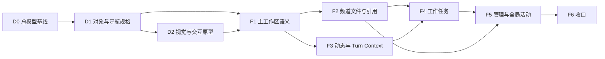

# atoll-web 前端产品体验改进总计划

状态：设计 D0–D2、施工 F1–F7 已完成；进入用户验收
日期：2026-08-24
适用仓库：`atoll-web`
后端前提：Atoll 的协议、账本、OBS、Actor、审批、资源和治理能力继续作为事实权威

关联文档：

- [产品交互总任务](PRODUCT-INTERACTION-MASTER-PLAN.md)：后端能力、Mock、真实服务端边界和阶段 A–E；
- [用户交互总规格](USER-INTERACTION-SPEC.md)：阶段 A–E 已交付用户旅程；
- [GenSpark 分层设计基准](GENSPARK-DESIGN-BENCHMARK.md)：参考产品研究和当前差距；
- [UI 交互架构](UI-INTERACTION-ARCHITECTURE.md)：表面、容器和响应式基线；
- [UI 组件重构计划](UI-COMPONENT-REFACTOR-PLAN.md)：基础组件与 CSS 工程边界；
- [构建规格](BUILD-SPEC.md)：协议、状态和模块实现约束；
- [测试指南](TESTING.md)：Mock、浏览器回归和构建门禁。
- [D1 对象与导航详细规格](FRONTEND-D1-OBJECT-NAVIGATION-SPEC.md)：产品对象、三主视图、Context、URL 与恢复状态机。
- [D2 视觉与交互原型规格](FRONTEND-D2-VISUAL-INTERACTION-SPEC.md)：视觉 token、表面状态、响应式、无障碍和高保真原型。

## 0. 文档定位

本文是阶段 A–E 完成后的前端产品体验改进总入口。

阶段 A–E 解决的是“能力是否真实、正确、可恢复、可测试”；本计划解决的是“成熟后端能力是否被组织成用户能理解、愿意持续使用的产品”。两者不能混为同一完成状态。

本文统一回答：

1. Atoll 前端最终是什么产品；
2. 后端能力如何映射为用户对象，而不是映射为调试表单；
3. 动态、产物、任务、成员和管理如何形成连续工作流；
4. 每个主交互区应该怎样布局、反馈和响应；
5. 哪些属于设计，哪些属于施工；
6. Mock、浏览器测试和真实后端分别证明什么；
7. 下一阶段按什么顺序实施，何时才算完成。

## 1. 当前判断

### 1.1 后端能力不是主要瓶颈

Atoll 已经提供比普通协作产品更强的基础：

- 频道是可回放的事实账本，不只是易失聊天记录；
- receipt、feed 和 OBS 可以区分提交、确认和投影；
- Agent 回合具有 request、provisional process、terminal 和稳定标识；
- cancel、steer、interrupt、queue 具有不同语义；
- 审批、结构化终态和动态 Schema 是正式协议对象；
- Actor 能力可以发现，治理操作仍通过统一消息面入账；
- 频道、成员、Actor、模板、设备、资源和定时器有真实闭环；
- Mock 可以复现乱序、延迟、断线、冲突和权限变化。

这些能力足以支撑一个比 GenSpark 更可信、更可审计、更适合复杂 Agent 协作的前端。

### 1.2 前端当前的主要问题

前端的问题不是“功能太少”，而是“能力翻译失败”：

| 后端事实 | 当前前端表达 | 用户实际需要 |
|---|---|---|
| resource ticket + 文件数据面 | daemon、路径、PUT 表单 | 上传、预览、引用、追溯频道产物 |
| after/cancel_timer | JSON 定时器面板 | 可理解的自动动作，以及与工作任务明确区分 |
| provisional process / terminal | 过程气泡与最终正文 | 当前进展、最终结果、必要时查看过程证据 |
| actor.describe + schema | 独立能力表单 | 从当前工作语境调用能力并理解风险 |
| channel/actor governance | 多个管理表单 | 围绕频道成员和运行状态完成治理 |
| feed 中的附件和结构化结果 | 分散卡片 | 可搜索、可预览、可回到来源的产物体系 |

### 1.3 本质问题

当前页面以“后端能做什么”组织，而成熟产品必须以“用户正在推进什么工作”组织。

```text
错误方向：协议 verb → 表单 → receipt → 结果卡

目标方向：用户目标 → 工作对象 → 连续状态 → 合适的交互表面
                         ↘ 底层仍由统一账本和协议证明
```

## 2. 产品北极星

atoll-web 是一个以可信频道账本为基础的人与 Agent 协作工作台。

用户进入一个频道后，应能在不理解 WS、OBS、registrar、daemon、ticket 或 payload JSON 的情况下：

- 知道团队发生了什么；
- 知道谁正在处理什么；
- 看见并使用已经形成的文件和结构化产物；
- 把消息中的承诺变成可追踪任务；
- 处理审批、异常和需要介入的回合；
- 查看参与者能力并在语境中调用；
- 管理频道成员和设置；
- 在任何写操作后理解“发送中、已接受、已确认、结果未知”；
- 在刷新、断线、切频道和权限变化后恢复到同一工作对象。

产品不能退化成两种极端：

- 不能成为只展示最终文本、隐藏可信账本能力的普通聊天 UI；
- 不能成为把协议字段和管理命令直接暴露给用户的后端控制台。

## 3. 设计原则

### 3.1 用户对象优先，协议事实兜底

默认显示用户对象和业务语义；协议 envelope、request id、turn id、原始 JSON 和 ticket 进入诊断详情。隐藏技术字段不等于丢失事实。

### 3.2 一个对象，多种投影

消息中的附件、Files 中的文件和详情中的预览必须是同一个产物对象。任务卡、Tasks 列表和来源消息必须是同一个任务对象。不得为不同页面复制互不关联的局部状态。

### 3.3 主视图必须兑现空间承诺

点击“动态 / 产物 / 任务”必须替换主工作区内容。右侧 Context Pane 只展示当前对象详情，不能冒充主视图。

### 3.4 账本主线与技术证据分层

主时间线突出人类决策、Agent 进展、产物和终态；工具调用和 provisional 仍可回看，但进入回合详情或折叠过程。可信不等于默认噪音最大。

### 3.5 创建、浏览、详情、管理使用不同容器

- 主对象集合：Workspace View；
- 持续详情：Context Pane；
- 局部动作：Popover；
- 短创建事务：Modal；
- 高风险动作：Inline Confirmation；
- 跨频道过程：Operation Center。

### 3.6 状态必须可解释、可恢复

所有写操作统一遵循：

```text
editing → submitting → accepted → confirmed
                    ↘ uncertain → replay 后 confirmed / recoverable error
                    ↘ rejected
```

切频道只切视图，不改变操作归属。刷新后从账本、OBS 和本地安全状态重建，而不是依赖组件 Promise。

### 3.7 Mock 展示真实工作，不展示随机噪音

动态演示必须围绕一个可理解的目标产生多 Agent 分工、条件变化、文件修订、审批和最终收敛。周期事件只表达状态，不得刷满主账本。

## 4. 目标对象模型

前端必须先建立统一产品对象，再建设页面。

### 4.1 ChannelContext

表示用户当前持续工作的频道上下文：

- 频道身份、父子关系和介绍；
- access、membership、serving 和 freshness；
- 当前用户在频道中的 Actor 映射；
- 未读、待处理和后台活动摘要；
- 当前主视图、选中对象和返回来源。

### 4.2 WorkTurn

表示一次用户请求或 Agent 主动工作的完整回合：

- request、parent、turn 和 actor 标识；
- 当前阶段、provisional process、approval 和 terminal；
- 可用控制及其权限；
- 产生的产物和任务；
- 异常、冲突、取消和替代关系。

`WorkTurn` 是账本 fold 的产品投影，不改变协议事实。

### 4.3 ChannelMount 与 Artifact Reference

`ChannelMount` 是文件主视图的第一事实：每个频道在已连接 daemon 上拥有以
`daemon://{device_id}/{channel_id}/` 为根的默认挂载目录。界面首先按设备、目录、
面包屑和真实 `resource list query.prefix` 展示文件系统；不得从消息附件反推一个虚假的
“全局产物库”。

`Artifact Reference` 表示频道动态对文件或结构化结果形成的可追溯引用：

- `resource_id`、address、名称、类型、大小；
- 作者/产生它的 Actor、时间、来源回合；
- 文件、结构化表格、清单、报告或其他类型；
- available、uploading、waiting_confirmation、failed、unavailable；
- version_of、derived_from 和引用关系；
- preview、download、attach、open_source 等动作。

Artifact 引用索引必须能从 feed 重放构建，不能只保存在组件 `useState`。它是挂载目录之上的
来源、作者、版本和派生语义，不替代目录本身；未被消息引用的普通频道文件也必须可见。

### 4.4 WorkItem

表示需要继续行动或关注的对象：

- 普通工作任务；
- 待审批；
- 运行中的 Agent 回合；
- 可恢复失败；
- 自动动作。

公共字段：来源、频道、负责人、状态、优先级、截止/等待条件、最近变化。不同类型保留自己的真实语义，不能强行合并为 timer。

### 4.5 Participant

统一呈现 human、agent 和 tool：

- 用户首先看到名称、角色、能力、状态和是否可服务；
- principal、actor、declaration 和 endpoint 是详情或创建时的专业信息；
- `system`、registrar seat、svcactor 等标准 Actor 默认隐藏；
- 管理路由仍使用完整原始名册。

### 4.6 Operation

表示跨视图持续的写操作：上传、频道创建、Actor 启动、长任务、设备动作等。它必须绑定来源频道和对象，进入 Operation Center，并可以返回原上下文。

## 5. 目标信息架构

```text
App
├─ Global Rail
│  ├─ 协作
│  ├─ 活动
│  ├─ 成员 / Actor
│  ├─ 设备与连接器（按权限）
│  └─ 账户
├─ Channel Rail
│  ├─ 搜索 / 快速跳转
│  ├─ 我的频道
│  ├─ 空间频道
│  └─ 创建频道
├─ Channel Workspace
│  ├─ Channel Header
│  ├─ Workspace Tabs
│  │  ├─ 动态
│  │  ├─ 产物
│  │  └─ 任务
│  └─ Primary Content
├─ Context Pane
│  ├─ Thread / 回合详情
│  ├─ 产物预览与来源
│  ├─ 任务详情
│  ├─ Actor 详情
│  └─ 频道成员与设置
└─ Global Layers
   ├─ Modal
   ├─ Popover
   ├─ Toast / Banner
   └─ Operation Center
```

“账本”在产品层改称“动态”更容易理解；可信账本仍是底层事实和诊断概念。最终名称在线框评审时确认。

## 6. 核心用户旅程

### 6.1 进入并理解频道

1. 从频道 Rail 看到名称、未读、不可用和待处理提示；
2. 进入后先显示缓存内容和同步状态；
3. Header 展示频道身份、成员、搜索和更多操作；
4. 默认落在动态视图，并恢复上次阅读位置；
5. 访问状态变化时保留可读事实，写入口在原位说明原因。

### 6.2 发起并观察 Agent 工作

1. 用户在 Composer 中选择目标或通过 `@` 指定参与者；
2. 提交后立即出现本地请求状态；
3. receipt 到达后显示“已接受”；
4. Agent 工作中显示克制进展，不把每个工具事件铺满主线；
5. 用户可进入回合详情查看完整过程，或执行 cancel/steer/interrupt；
6. terminal 到达后直接展示可理解结果、产物和后续动作。

### 6.3 产生、修订和使用产物

1. 用户上传文件时，文件先进入 Composer 草稿；
2. 随消息发送后进入账本并显示上传/确认状态；
3. Agent 生成的文件或结构化结果紧跟来源终态；
4. 产物视图自动聚合，无需用户再次登记；
5. 点击产物进入预览，能返回来源消息；
6. 在 Thread 中提出修订后，v2 与 v1 建立关系；
7. 权限或 ticket 失效只影响动作，不抹掉产物事实。

### 6.4 从消息形成任务

1. 用户在消息或终态的局部操作中选择“创建任务”；
2. 系统继承来源频道、消息、相关 Actor 和上下文摘要；
3. 用户补充自然语言目标、负责人和截止条件；
4. Tasks 主视图按 For me / All、类型和状态查看；
5. 任务变化回写来源上下文或产生账本事实；
6. 审批、运行中回合和可恢复失败进入统一待处理视图，但保留类型差异。

### 6.5 管理成员和能力

1. 从 Header 打开频道详情；
2. 首屏看到业务成员、角色、在线/服务状态和添加入口；
3. 添加参与者时先搜索候选对象，再根据其类型展示必要配置；
4. Actor 详情展示能力、当前任务和高风险控制；
5. 提交治理动作后进入 Operation，并等待 terminal、OBS、membership 和 serving 收敛；
6. 失败保留已经完成的事实和恢复入口。

### 6.6 跨频道持续工作

上传、长任务、频道创建和 Actor 启动在用户切换频道后继续绑定原频道。全局活动和 Operation Center 提示重要变化，点击后返回对应频道与对象。

## 7. 主交互区设计

### 7.1 Channel Rail

- 宽屏固定、窄屏逐层进入；
- 搜索和 `⌘K` 用于跳转，不在列表顶部堆过滤表单；
- “我的频道”和“空间”严格分组；
- 状态只展示需要用户理解的结果，不展示 raw wire state；
- 行级更多操作 Hover/Focus 出现；
- 创建频道是清晰的独立动作。

### 7.2 动态视图

- 普通消息和 Agent 输出共用统一阅读轴；
- 身份、时间、AI/主动状态形成轻元信息；
- 系统事件压缩成单行；
- 文件、结构化产物、审批、错误和重要终态使用对象边界；
- 运行中回合展示阶段和必要控制；
- 完成后的技术过程默认折叠，完整证据进入回合详情；
- Hover/Focus 操作包含回复、Thread、创建任务、保存和更多；
- 日期、未读和同步边界必须明确。

### 7.3 Composer

- 属于动态视图，不在产物/任务视图继续显示；
- 支持多行文本、`@`、附件、格式和发送选项；
- 附件直接进入草稿，不要求先访问资源管理页；
- 目标 Actor 始终可见且可修改；
- Enter / Shift+Enter 行为明确且可配置；
- 离线、无权限和频道不可用时保留草稿，并在原位置解释；
- advanced payload 只在能力调用或诊断模式出现。

### 7.4 产物视图

主区结构：

```text
Header：搜索 / 类型 / 作者 / 时间 / 上传
Summary：最近更新、等待确认、失败
List/Grid：文件和结构化产物
Context：预览、来源、版本、引用和操作
```

文件行至少展示：预览、名称、作者/Actor、来源时间、类型、大小、状态和更多操作。默认动作是打开预览，不是下载。

KV 不与文件默认并列。KV 进入“数据对象”子类型或开发者工具；ticket、daemon、address 和 PUT 阶段只在上传异常详情展示。

### 7.5 任务视图

主区至少包含：

- For me / All；
- Active / Waiting / Completed / Failed；
- 类型：工作任务、审批、运行中回合、自动动作；
- 负责人、来源、截止/等待条件、最近更新；
- 从来源消息创建和返回来源；
- 独立“新建任务”入口。

Timer 设置迁入“自动动作”，普通用户不填写毫秒和 JSON；高级模式可以查看精确 duration、type 和 payload。

### 7.6 Context Pane

- 宽屏并列，中屏接管工作区，窄屏全屏；
- 同时只打开一个对象详情；
- 必须有标题、关闭、唯一滚动区和来源返回；
- Thread 根消息固定在顶部；
- 文件预览优先使用空间，其元数据和操作保持可达；
- 管理详情按成员、通知、权限、邀请、基本信息和危险操作排序。

### 7.7 全局活动与 Operation Center

- Activity 汇总跨频道需要关注的终态、审批、失败和成员变化；
- Operation Center 汇总尚未收敛的上传、创建、启动和治理动作；
- 同一事实不通过 Toast、角标和列表重复轰炸；
- 每条都能回到来源频道和对象。

## 8. 视觉与布局系统

### 8.1 表面层级

- Global Rail：最深的环境层；
- Channel Rail：暖色导航层；
- Workspace：白色主要工作层；
- Context Pane：与导航同族的详情层；
- Modal/Popover：短暂浮层。

大区主要通过背景差异和 1px 分隔线区分，避免大阴影、重复外框和卡片套卡片。

### 8.2 线条和卡片

- 页面骨架使用单像素低对比分隔线；
- 普通消息无边框；
- 可操作对象才获得边界和 Hover 状态；
- 表单分组靠标题、间距和说明，不默认给每组套厚卡片；
- 危险、错误、审批和未知结果使用语义边界，不只使用颜色。

### 8.3 密度和排版

- 正文保持统一阅读轴和受控最大宽度；
- 元信息比正文弱一级，不使用大量全大写 eyebrow；
- 技术标识使用 mono，但默认截断并可复制；
- Header、Tabs、Content、Composer 的水平边界稳定；
- 同一层级的点击目标尺寸和间距统一；
- 空态要解释下一步，不用装饰性大图占据工作区。

### 8.4 动效

- 动效只用于解释状态变化、表面进入和对象归属；
- 禁止为持续 pulse 使用无限跳动；
- 支持 `prefers-reduced-motion`；
- 流式内容避免导致整个时间线频繁位移。

## 9. 响应式状态机

断点最终由真实内容压力测试确定，不以设备名称硬编码。

### 宽屏

Channel Rail + Workspace + 可选 Context Pane 并列。产物预览和 Thread 可以与主视图同时存在。

### 中屏

Channel Rail 保留；Context Pane 打开时替换 Workspace，不把两者压成不可读窄栏。关闭后恢复原主视图和滚动位置。

### 窄屏

同一时间只展示一个层级：频道列表、主视图或详情。每层都有明确返回路径。Composer、审批操作和任务控制必须保持可达。

### 必须保持的状态

- 当前频道；
- 当前主视图；
- 选中对象和来源；
- 每个主视图的滚动/过滤状态；
- 未发送草稿和附件；
- 正在进行的 Operation。

所有断点必须满足无横向页面溢出、键盘可达、焦点不丢失和浏览器缩放 200% 可用。

## 10. 前端分层与状态归属

```text
protocol / net
  → 原始契约、WS、OBS、HTTP 数据面
domain models
  → access、fold、artifact、work-item、participant、operation
selectors / indexes
  → 可重放的频道派生视图
application hooks
  → 生命周期、缓存、后台操作与导航
product surfaces
  → Dynamic、Artifacts、Tasks、Context
ui primitives
  → Modal、Pane、Popover、Menu、Field、Confirmation
```

禁止：

- 页面组件自行重新解释 envelope；
- 用组件 `useState` 充当频道持久索引；
- 依赖当前 active channel 决定后台操作归属；
- 为方便 UI 伪造后端不存在的成功事实；
- 把不同状态机强行合并为一个通用 `status` 字符串。

## 11. Mock 改进计划

现有 Mock 的协议和故障能力继续保留，新增“产品叙事层”。

### 11.1 场景要求

每个主要场景必须包含：目标、参与者、触发事件、产物演进、用户决策、异常或条件变化、最终收敛。

首批产品场景：

1. `research-deliverable`：研究请求 → 报告 v1 → Thread 修订 → v2 → 验收任务；
2. `budget-review`：结构化模型 → 多文件产出 → 条件变化 → 人类审批 → 跨文件校验；
3. `incident-response`：告警 → 多 Agent 排查 → 运行中控制 → 修复产物 → 复盘任务；
4. `channel-onboarding`：创建频道 → 添加 human/agent/tool → serving 延迟 → 首个协作任务；
5. `permission-loss`：工作中权限撤销，动态、产物和任务统一转只读；
6. `offline-recovery`：上传和任务进行中断线，重连后从 feed/OBS 对账。

### 11.2 动态规则

- 虚拟时间和固定随机种子；
- pulse 只保留最新状态；
- 动态事件必须推动场景，不生成无意义重复消息；
- 文件必须有来源、版本和状态；
- 任务必须有来源、负责人和状态变化；
- 每个正常场景至少有一个反例变体。

### 11.3 Mock 与真实后端边界

Mock 证明产品状态机、布局、交互和可恢复行为；真实服务端 smoke 继续证明 daemon 路由、文件落盘、ticket 生命周期、真实 Actor 时序、并发权限和跨端 timer 等运行时事实。

## 12. 测试与验收体系

### 12.1 模型测试

- Artifact 索引从历史重放和实时 feed 得到相同结果；
- WorkItem 在乱序、重复、取消、审批和失败下正确收敛；
- 来源关系在刷新和切频道后保持；
- Operation 不随 active channel 串写；
- 脱敏字段不进入缓存、快照和日志。

### 12.2 组件契约测试

- Workspace Tab 真正替换主内容；
- Context Pane 保留来源和返回；
- Composer 附件、禁用原因和草稿不丢失；
- 文件预览、任务详情和 Thread 使用同一表面契约；
- Menu、Select、Modal 不改变周围布局。

### 12.3 浏览器用户旅程

不得只按页面或后端 verb 测试。至少覆盖：

```text
进入频道
→ 发起 Agent 工作
→ 查看进展与回合详情
→ 产生并预览文件
→ 从 Thread 要求修订
→ 从消息创建任务
→ 切频道等待后台完成
→ 从 Activity 返回来源
→ 断线并恢复
→ 权限变化后只读收敛
```

### 12.4 视觉与响应式

- 宽屏、中屏、窄屏和 200% 缩放；
- 动态、产物、任务、Thread、预览、管理和 Modal 独立基线；
- 空态、长文本、超长文件名、大成员列表和多任务压力场景；
- 截图必须使用有意义的场景内容，不用随机 pulse 填充。

### 12.5 门禁

每个施工波次必须通过：

- `git diff --check`；
- 相关 Vitest；
- 相关 Playwright 旅程；
- 视觉基线人工检查；
- `npm run build`；
- 无新增协议旁路或敏感数据泄漏；
- 文档状态与实现一致。

## 13. 设计阶段与施工阶段

本计划使用两套编号，避免再次把设计和施工混为一谈。

### 设计阶段 D0：总模型基线

状态：**本文完成后视为完成**。

交付物：产品北极星、对象模型、信息架构、用户旅程、主视图定义、分阶段路线。

不包含：React 实现、CSS、Mock 新场景和测试改动。

### 设计阶段 D1：对象与导航详细规格

状态：**已完成（2026-08-18）**，详细规格见 [FRONTEND-D1-OBJECT-NAVIGATION-SPEC.md](FRONTEND-D1-OBJECT-NAVIGATION-SPEC.md)。

交付物：

- Artifact、WorkItem、Operation 和 SourceRef 字段/状态图；
- Dynamic / Artifacts / Tasks 三个主视图线框；
- Thread、文件预览、任务详情和频道详情的 Context Pane 线框；
- 主视图和详情之间的 URL/状态恢复规则；
- 宽、中、窄屏表面状态图；
- 空态、错误、权限和未知结果矩阵。

门禁：规格能用完整用户旅程走通，且不需要页面临时猜测协议事实。

### 设计阶段 D2：视觉系统与交互原型

状态：**已完成（2026-08-18）**，详细规格见 [FRONTEND-D2-VISUAL-INTERACTION-SPEC.md](FRONTEND-D2-VISUAL-INTERACTION-SPEC.md)。

交付物：

- 颜色、间距、排版、边线、图标、状态和动效 token；
- 关键页面高保真原型；
- 文件上传/预览/修订、任务创建、Thread 和管理原型；
- 1280、800、600、320 和 200% 缩放原型；
- 键盘、焦点和无障碍说明。

门禁：通过视觉一致性、信息密度、长内容和窄屏评审后才施工。

### 施工波次 F1：主工作区语义纠正

状态：**已完成（2026-08-18）**。

- 建立真正的 Dynamic / Artifacts / Tasks 主视图容器；
- Composer 只属于 Dynamic；
- Context Pane 与 Workspace View 分离；
- URL/导航状态可恢复；
- 保持现有能力可用，不在此波次重做领域模型。

### 施工波次 F2：频道文件与引用

状态：**已完成（2026-08-18）**。

- 建立 Artifact 索引和 SourceRef；
- 文件从组件会话状态迁出；
- 上传直接进入 Composer；
- 产物主视图、预览、来源、状态和版本；
- KV 退出默认文件首页；
- 新增研究交付物和预算修订 Mock 场景。

### 施工波次 F3：动态、Thread 与 Composer

状态：**已完成（2026-08-18）**。

- 工作叙事层和系统事件分级；
- Thread/回合详情；
- Hover/Focus 消息操作；
- Composer 多行、附件和发送选项；
- 技术过程迁入详情，同时保持完整可审计性。

### 施工波次 F4：工作任务体系

- 建立 WorkItem 索引；
- 从消息/终态创建任务；
- Tasks 主视图和详情；
- 审批、运行中回合、失败恢复和自动动作分类；
- timer 从“任务替代品”归位为自动动作。

### 施工波次 F5：成员、管理和全局活动

- 参与者优先的添加流程；
- 频道详情信息顺序重构；
- Activity 和 Operation Center；
- 搜索和跨频道返回来源；
- 空间治理保持独立管理区。

### 施工波次 F6：视觉、响应式、性能与无障碍收口

状态：已完成（2026-08-18）

- 统一视觉 token 和组件状态；
- 完成表面替换响应式；
- 大历史、长列表、预览和流式更新性能；
- 键盘、焦点、live region、缩放和 reduced motion；
- 删除过渡实现、旧面板和重复 CSS；
- 完成全量视觉基线和真实后端 smoke。

## 14. 阶段依赖



D1/D2 未完成前不得直接进入 F2–F5。F1 可以做有限的容器语义修正，但不能借机临时发明 Artifact 或 WorkItem 模型。

## 15. 非目标与边界

- 不复制 GenSpark 品牌、文案、图标或像素值；
- 不为了外观绕开 Atoll 统一消息面；
- 不把 Mock 未证明的真实运行时事实宣告完成；
- 不在前端伪造后端没有的跨端 timer 列表；
- 不把系统 Actor 暴露给普通用户；
- 不在此次体验升级中重写已经通过测试的协议和 fold 核心；
- 不用一次“大重写”替代可验证的施工波次；
- 不以组件拆分、截图相似或测试数量作为产品完成证据。

## 16. 风险和待设计问题

### P0

1. Artifact 引用是否能完全从现有 feed/terminal 重建；目录文件事实由 resource list 提供，两者不得混为同一索引。
2. WorkItem 是否作为纯前端派生对象，还是需要新的后端正式任务类型。
3. 文件版本关系由明确字段、parent/source 推导，还是先以用户操作建立。
4. Thread 是新的消息关系，还是现有 parent/correlation 的产品投影；不能凭 UI 猜测。

### P1

5. “账本”最终面向用户命名为“动态”“协作”还是保留“账本”。
6. 结构化终态进入 Artifacts 的准入规则，避免所有 JSON 都成为产物。
7. Activity 的优先级和去重规则。
8. 频道 URL、对象 URL 和刷新恢复策略。

### P2

9. Reaction、Saved 和 Direct messages 是否有后端事实支持；无支持时不照抄入口。
10. 富文本编辑需要什么最小格式集，是否进入正式 envelope。

## 17. 总体完成定义

本轮前端体验升级只有同时满足以下条件才算完成：

- 三个主视图兑现空间和对象语义；
- 文件、结构化结果和任务都能回到来源；
- 用户上传文件不需要理解 ticket、daemon 和 address；
- 用户可以从消息创建并追踪任务；
- 长任务主线简洁、过程完整可达、控制语义准确；
- 管理区按用户目标组织，同时保留真实治理收敛；
- 宽、中、窄屏是明确状态机，不是三栏挤压；
- 刷新、断线、切频道、乱序和权限变化后对象关系不丢失；
- Mock 有完整叙事场景和异常变体；
- 全量单元、浏览器、视觉、构建和真实后端 smoke 通过；
- 现有阶段 A–E 能力没有回归；
- 文档、实现、Mock 和测试对同一产品模型无漂移。

## 18. 当前状态与唯一下一步

当前完成：

- 阶段 A–E 后端能力产品化和可靠 Mock 基线；
- UI 基础组件重构；
- 第一轮工作台视觉与响应式修正；
- GenSpark 分层设计研究；
- 本文 D0 总模型基线。
- D1 对象与导航详细规格。
- D2 视觉系统与交互原型。
- F1 主工作区语义纠正。
- F2 文件引用模型；F6 已纠正为“频道默认挂载目录优先、消息引用附加”的文件体验。
- F3 动态、回合详情与 Composer。
- F4 WorkItem、Tasks、来源创建与自动动作归类。
- F5 成员优先频道详情、独立新建频道 Modal、全局活动与搜索返回来源。
- F6 Atoll 自有视觉 Token、消息阅读体验、多档响应式、键盘/焦点/对比度、长列表/预览性能、视觉基线和真实 Atoll smoke。
- F7 RequestTurn 单一过程协议、Agent 调用消息树、父子过程隔离与旧 Activity 协议退役。

当前未完成：无 F1–F7 施工项。生产环境的多节点并发、重启持久化、ticket/磁盘、timer 跨端、设备安全和 TLS/反向代理仍是发布前专项边界，不属于 Mock 或单节点 smoke 的完成事实。

**下一步是用户验收与真实部署边界验证，不再继续发明新的前端施工波次。**

F1 已建立三主视图和 Context Host；F2 建立了可信 Artifact Reference，F6 进一步把真实频道挂载目录恢复为文件主入口；F3 已完成动态阅读轴、连续消息节奏、完整回合审计、消息操作与 Composer；F4 已建立真实能力边界内的 WorkItem 索引、Tasks 主视图、各类详情与来源创建旅程；F5 已完成成员优先管理、频道创建 Modal、Activity/Operation Center、权限过滤和全局搜索返回来源；F6 已统一视觉与组件状态，完成响应式、性能、无障碍、过渡实现清理和真实后端 smoke；F7 将过程统一到所属 request 的 provisional response，并用真实子 RequestTurn 构造多 Agent 消息树。
